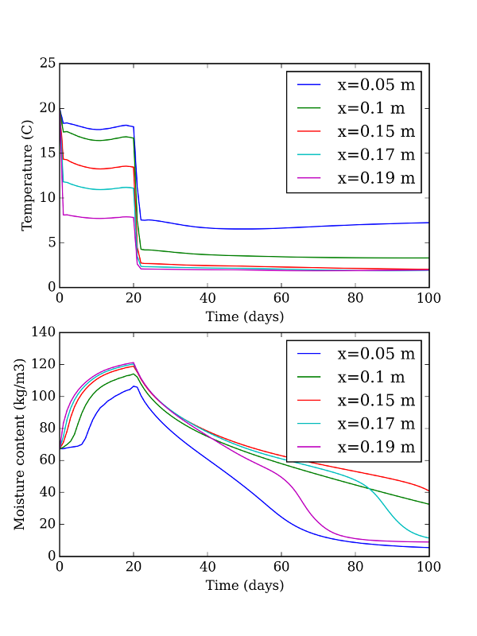

# Hamstad BM3

This script simulates the third exercise of the Hamstad benchmark package: transient heat and moisture transfer impacted by air flow through a lightweight wall.

Note that the external air pressure fluctuates on one side of the domain, and that its values are read from a .txt file which has two columns labeled `Time (s)` and `DeltaP`. This file is available in the `hamopy/benchmarks` folder

## Script

	from hamopy.classes import Mesh, Boundary, Time

	# Meshing
	from hamopy.materials.hamstad import BM3

	mesh = Mesh(**{"materials"    : [BM3],
		       "sizes"        : [0.2],
		       "nbr_elements" : [40] })

	# Boundary conditions
	clim_file = 'BM3 climate.txt'

	clim1 = Boundary('Fourier',**{"file"      : clim_file,
		                      "time"      : "Time (s)",
		                      "T"         : 293.15,
		                      "HR"        : 0.7,
		                      "h_t"       : 10,
		                      "h_m"       : 2e-7,
		                      "P_air"     : "DeltaP"})

	clim2 = Boundary('Fourier',**{"T"         : 275.15,
		                      "HR"        : 0.8,
		                      "h_t"       : 10,
		                      "h_m"       : 7.38e-12 })
	clim = [clim1, clim2]

	# Initial conditions
	init = {'T'  : 293.15,
		'HR' : 0.95}

	# Temporal discretisation
	time = Time('variable',**{"delta_t"  : 900,
		                  "t_max"    : 8640000,
		                  "iter_max" : 12,
		                  "delta_min": 1e-3,
		                  "delta_max": 900 } )

	if __name__ == "__main__":
	    
	    import numpy  as np
	    import pandas as pd
	    
	    # Simulation
	    from hamopy.algorithm import calcul
	    results = calcul(mesh, clim, init, time)
	    
	    # Post-processing
	    from hamopy.postpro import evolution
	    data0 = pd.read_csv(clim_file, delimiter='\t')
	    t_out = np.array( data0['Time (s)'] )
	    x_out = [0.05, 0.1, 0.15, 0.17, 0.19]
	    
	    from hamopy import ham_library as ham
	    
	    Temperature     = np.column_stack([evolution(results, 'T', _, t_out) for _ in x_out])
	    Humidity        = np.column_stack([evolution(results, 'HR', _, t_out) for _ in x_out])
	    MoistureContent = BM3.w(ham.p_c(Humidity, Temperature), Temperature)
	    # Plotting results
	    
	    import matplotlib.pylab as plt
	    from matplotlib import rc
	    rc("font", family="serif", size=12)
	    
	    figsize(6, 8)

	    ax = plt.subplot(211)
	    
	    plt.plot(t_plot / (24*3600), Temperature)
	    plt.xlabel('Time (days)')
	    plt.ylabel('Temperature (C)')
	    plt.legend(('x=0.05 m', 'x=0.1 m', 'x=0.15 m', 'x=0.17 m', 'x=0.19 m'))
	    
	    ax = plt.subplot(212)
	    
	    plt.plot(t_plot / (24*3600), MoistCont)
	    plt.xlabel('Time (days)')
	    plt.ylabel('Moisture content (kg/m3)')
	    plt.legend(('x=0.05 m', 'x=0.1 m', 'x=0.15 m', 'x=0.17 m', 'x=0.19 m'))
	    
	    fig = plt.gcf()
	    fig.savefig('BM3_results.png', format='png', dpi = 300)

## Results

