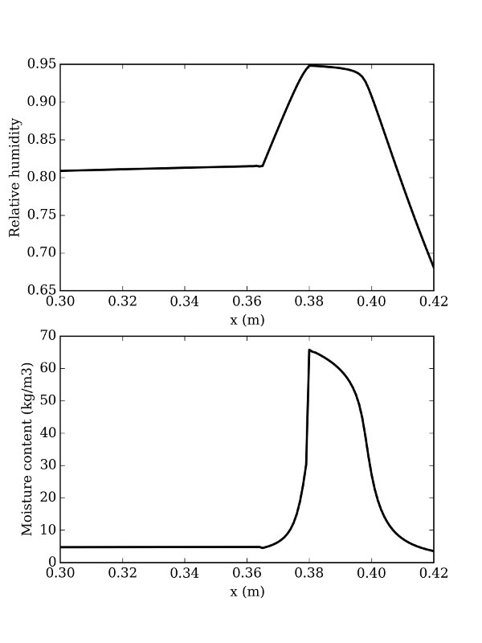

# Hamstad BM5

This script simulates the fifth exercise of the Hamstad benchmark package: multi-layered wall with capillary active inside insulation

Since hamopy is not really speed-optimised, this may take a few minutes to compute.

## Script

	"""
	5th exercise of the Hamstad benchmark package

	Capillary active inside insulation
	"""

	from hamopy.classes import Mesh, Boundary, Time

	# Choice of materials and geometry
	from hamopy.materials.hamstad import BM5_brick, BM5_mortar, BM5_insulation

	mesh = Mesh(**{"materials"    : [BM5_brick, BM5_mortar, BM5_insulation],
		       "sizes"        : [0.365, 0.015, 0.040],
		       "nbr_elements" : [100, 20, 20] })

	# Boundary conditions
	clim1 = Boundary('Fourier',**{"T"   : 273.15,
		                      "HR"  : 0.8,
		                      "h_t" : 25.,
		                      "h_m" : 1.8382e-7 })
		                      
	clim2 = Boundary('Fourier',**{"T"   : 293.15,
		                      "HR"  : 0.6,
		                      "h_t" : 8.,
		                      "h_m" : 5.8823e-8 })

	clim = [clim1, clim2]

	# Initial conditions
	init = {'T'  : 298.15,
		'HR' : 0.6}

	# Time step size
	time = Time('variable',**{"delta_t"  : 900,
		                  "t_max"    : 12960000,
		                  "iter_max" : 12,
		                  "delta_min": 1e-3,
		                  "delta_max": 900 } )

	if __name__ == "__main__":
	    
	    import numpy as np
	    
	    # Calculation
	    from hamopy.algorithm import calcul
	    result = calcul(mesh, clim, init, time)
	    
	    # Post processing
	    from hamopy.postpro import distribution

	    t_plot = 12960000
	    x_plot = np.linspace(0, 0.42, 421)
	    
	    from hamopy import ham_library as ham
	    
	    Temperature = distribution(result, 'T', x_plot, t_plot)
	    Humidity    = distribution(result, 'HR', x_plot, t_plot)
	    Moisture    = np.zeros(np.shape(Temperature))
	    
	    # Moisture content distribution of each layer
	    for i in range(len(mesh.materials)):
		xmin = sum(mesh.sizes[0:i])
		xmax = sum(mesh.sizes[0:i+1])
		mask = ((x_plot >= xmin) & (x_plot <= xmax))
		Moisture[mask] = mesh.materials[i].w(ham.p_c(Humidity[mask],Temperature[mask]), Temperature[mask])
	    
	    # Plotting results
	    
	    import matplotlib.pylab as plt
	    from matplotlib import rc
	    rc("font", family="serif", size=12)
	    
	    figsize(6, 8)

	    ax = plt.subplot(211)
	    
	    plt.plot(x_plot[300:], Humidity[300:], 'k-', linewidth=2)
	    plt.xlabel('x (m)')
	    plt.ylabel('Relative humidity')
	    
	    ax = plt.subplot(212)
	    
	    plt.plot(x_plot[300:], Moisture[300:], 'k-', linewidth=2)
	    plt.xlabel('x (m)')
	    plt.ylabel('Moisture content (kg/m3)')
	    
	    fig = plt.gcf()
	    fig.savefig('BM5_results.png', format='png', dpi = 300)

## Results

